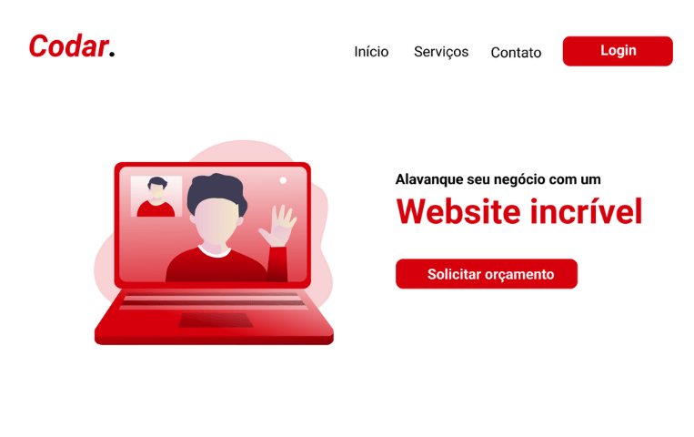
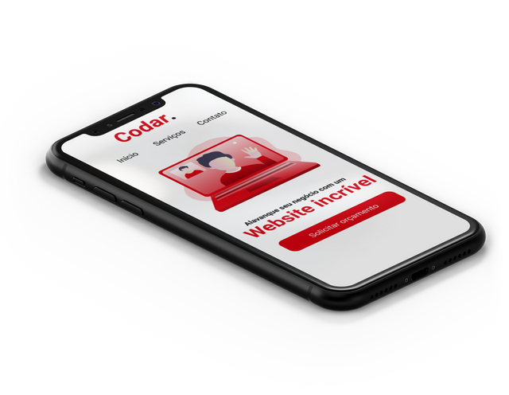
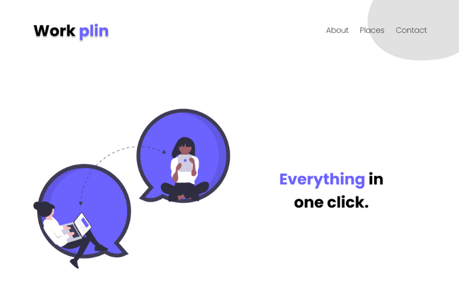
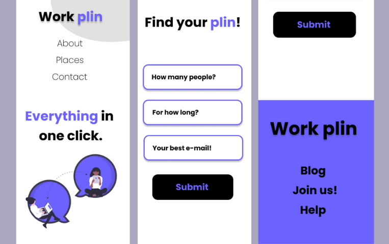
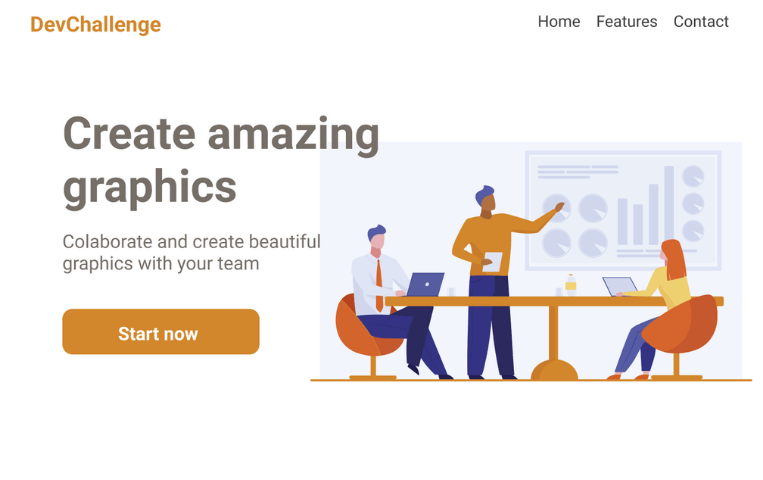
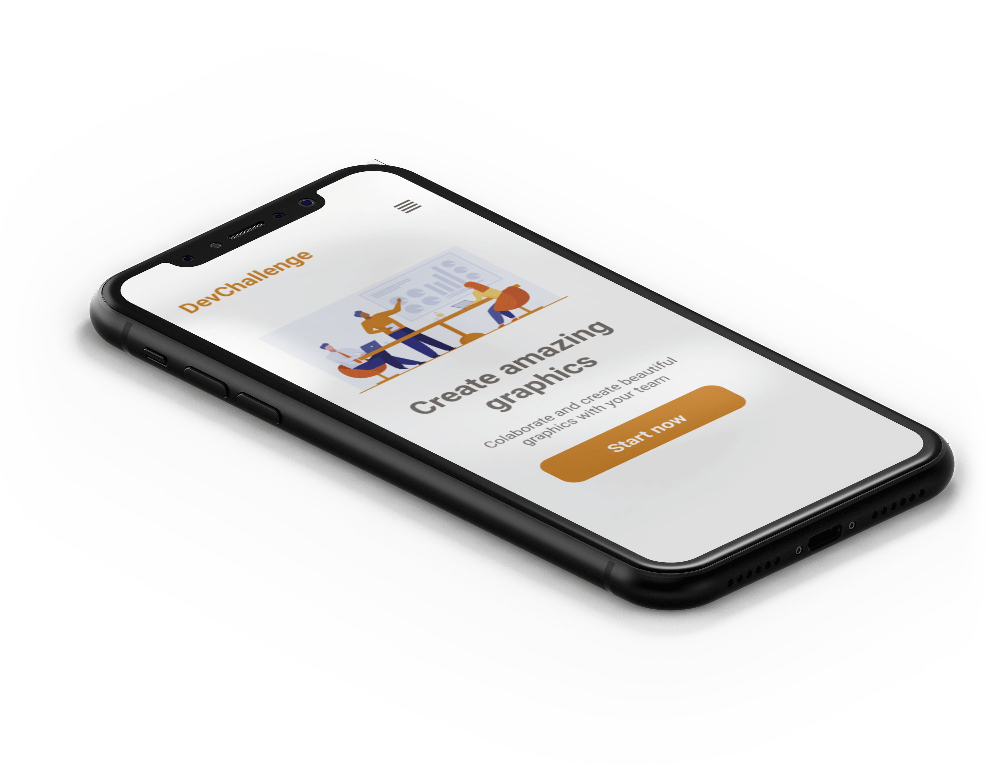
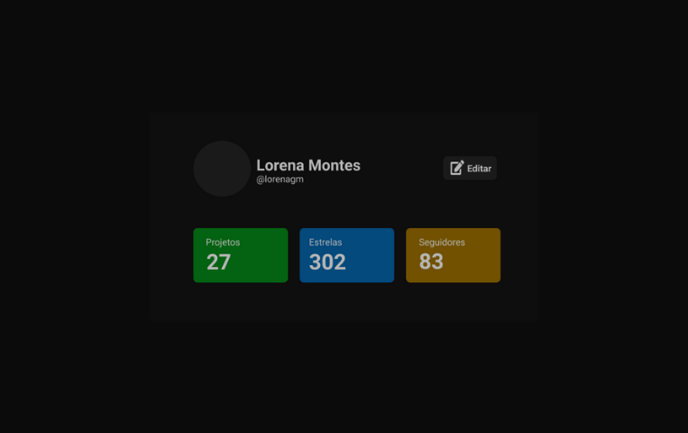
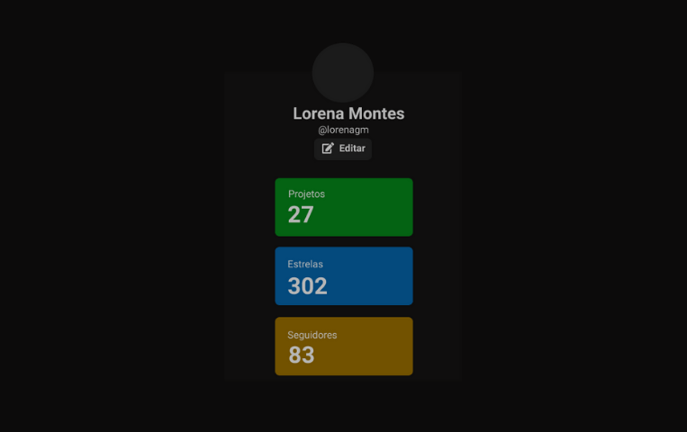

<h1>DevChallenge Projects</h1>

Challenges/Projects from: https://devchallenge.com.br/challenges

 

  

  
<h3 align="center">DevChallenge</h3>

  Site para desenvolvedores melhorarem suas habilidades através de desafios de front-end, back-end e mobile!
   
   
  A website for developers to improve their skills by doing front-end and back-end challenges
   
   
  <a href="https://www.devchallenge.com.br/">DevChallenge</a>    

 

## Codar ✨

<h3>Techs</h3>
<ul>
  <li>HTML</li>
  <li>CSS</li>
</ul>
<h2> Visualizar a Página:
🌐  <a href="https://vagnerthree-codar.netlify.app/">Codar Page</a>
</h2>

 

## Work Plin ✨

<h3>Techs</h3>
<ul>
  <li>HTML</li>
  <li>CSS</li>
</ul>

<h2> Visualizar a Página:
🌐<a href="https://vagnerthree-workplin.netlify.app/">Work Plin Page</a>
</h2>

 

## Amazing Graph ✨

<h3>Techs</h3>
<ul>
  <li>HTML</li>
  <li>CSS</li>
  <li>Javascript</li>
</ul>

<h2> Visualizar a Página:
🌐  <a href="https://vagnerthree-amazinggraph.netlify.app/">Amazing Graph Page</a>
</h2>

 

## Profile Component ✨

<h3>Techs</h3>
<ul>
  <li>HTML</li>
  <li>CSS</li>
</ul>
<h2> Visualizar a Página:
🌐  <a href="https://vagnerthree-profilecomponent.netlify.app/">Profile Component Page</a>
</h2>